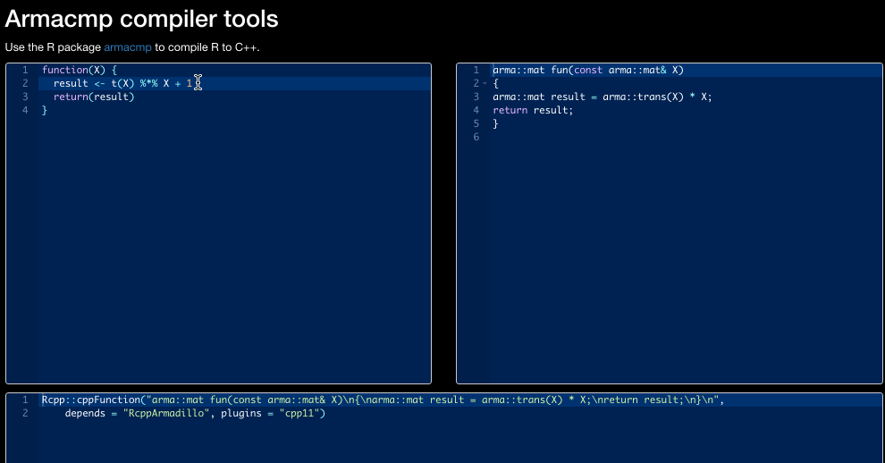

# armacmp-online

<!-- badges: start -->
<!-- badges: end -->

A small shiny app to live translate C++ code to R.

Deploy at your own risk as user input code is evaluated.



## Usage

To obtain a copy for your local computer, please use: 

```r
# Install required packages
install.packages(c("shiny", "remotes", "shinyAce"))

# Install armacmp
remotes::install_github("dirkschumacher/armacmp")

# Launch the translator application.
shiny::runGitHub("dirkschumacher/armacmp-shiny")
```

## License

MIT 
